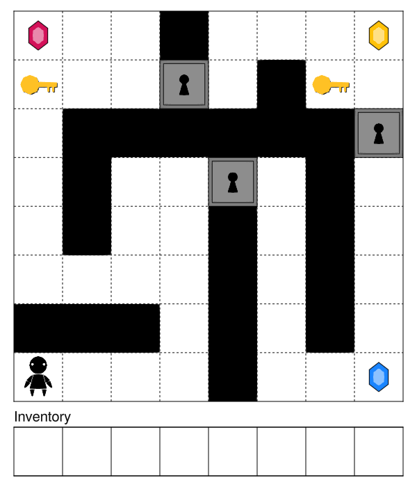

# PDDLViz.jl

A library for visualizing, animating, and interacting with PDDL domains, built on top of [Makie.jl](https://github.com/MakieOrg/Makie.jl).

## Installation

Press `]` at the Julia REPL to enter the package manager, then install this package along with `PDDL` and a `Makie` backend of your choice (e.g. `GLMakie`):

```
add https://github.com/JuliaPlanners/PDDLViz.jl.git
add PDDL GLMakie
```

## Usage

`PDDLViz.jl` provides a number of built-in renderer types for certain classes of domains, such as `GridworldRenderer`. Each renderer can be customized for a specific domain by passing in options to its constructor:

```julia
using PDDLViz, GLMakie

# Construct gridworld renderer
gem_colors = PDDLViz.colorschemes[:vibrant]
renderer = GridworldRenderer(
    agent_renderer = (d, s) -> HumanGraphic(color=:black),
    obj_renderers = Dict(
        :key => (d, s, o) -> KeyGraphic(
            visible=!s[Compound(:has, [o])]
        ),
        :door => (d, s, o) -> LockedDoorGraphic(
            visible=s[Compound(:locked, [o])]
        ),
        :gem => (d, s, o) -> GemGraphic(
            visible=!s[Compound(:has, [o])],
            color=gem_colors[parse(Int, string(o.name)[end])]
        )
    ),
    show_inventory = true,
    inventory_fns = [(d, s, o) -> s[Compound(:has, [o])]],
    inventory_types = [:item]
)
```

A renderer can then be used to render PDDL states:

```julia
using PDDL, PlanningDomains

# Load example gridworld domain and problem
domain = load_domain(:doors_keys_gems)
problem = load_problem(:doors_keys_gems, 3)

# Load array extension to PDDL
PDDL.Arrays.register!()

# Construct initial state from domain and problem
state = initstate(domain, problem)

# Render initial state
canvas = renderer(domain, state)

# Save rendered canvas to file
save("gridworld.png", canvas)
```

The rendered image is below:



See  [`test/gridworld/test.jl`](test/gridworld/test.jl) for examples of how to render plans, trajectories and planner solutions, how to animate trajectories, and how to enable interactive controls.
